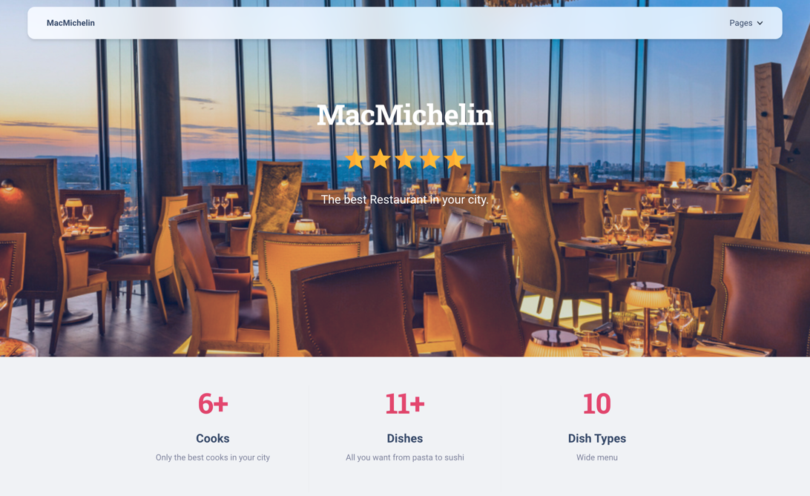

# restaurant-service

This is restaurant service, that help you find your favorite dish and cooker that may cook it.



On this website visitors may look dishes, watch details about each dish and cook.
There are navigation bar that help you to walk on website, create and update cook\`s and dish\`s information, 
if you have appropriate permission.
# Project models:
The project has 3 models:
   - Cooker
   - Dish
   - DishType


# Requirements
To install django type next command:
```python
$ python -m pip install Django
```
To run website type: 
```python
$ python manage.py runserver 127.0.0.1:8000 
```
- Numbers after 127.0.0.1: is optional. 


